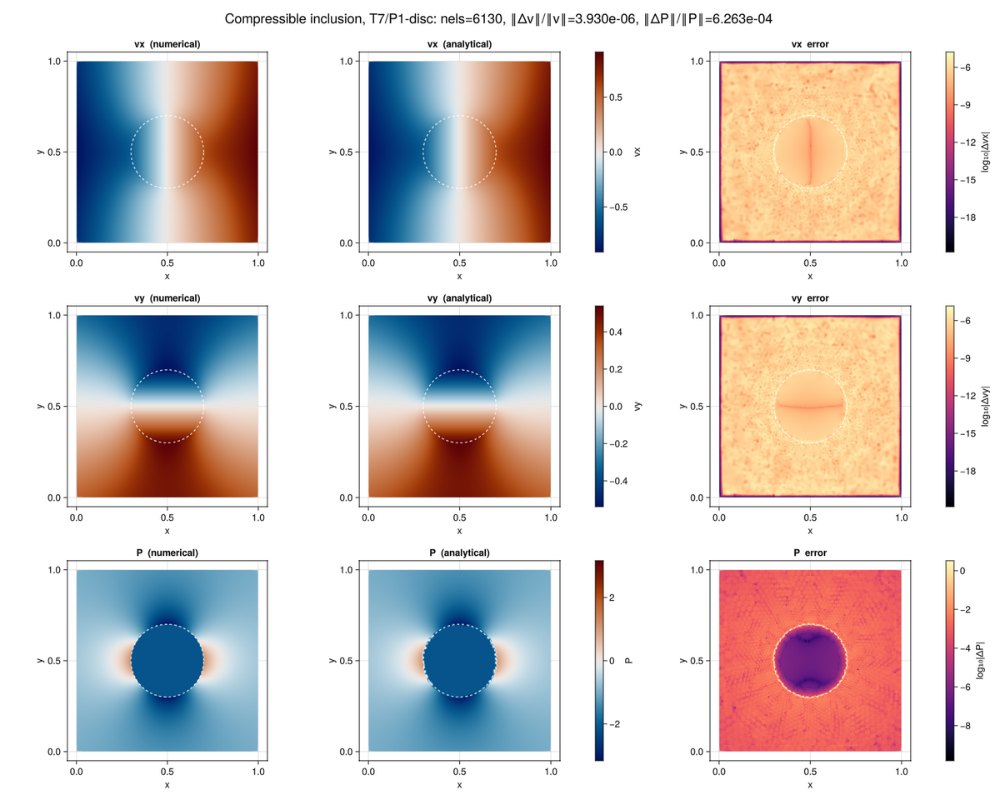

# Compressible inclusion

A circular inclusion sits in a matrix of contrasting shear *and* bulk
viscosity, driven by a far-field deviatoric plus volumetric strain rate. The
closed-form solution of Moutzouris & Duretz (2026), supplied by
[ExactFieldSolutions.jl](https://github.com/tduretz/ExactFieldSolutions.jl) as
`Stokes2D_Moutzouris_circle`, gives velocity, pressure, and deviatoric stress
everywhere, so the benchmark measures a true error rather than a difference
between two numerical solutions.

Three properties of the Stokes discretization are exercised at once: the
compressible pressure term, the T7/P1-disc velocity--pressure pair across a
material interface that no element edge crosses, and the isoparametric
(curved) elements that follow the circle.

The scripts live in `examples/stokes/benchmarks/`:

| file | role |
| --- | --- |
| `gmsh_inclusion_mesher.jl` | builds the interface-conforming T7 mesh |
| `stokes_2D_compressible_inclusion.jl` | defines `main`, solves one mesh, returns L2 errors |
| `run_convergence_sweep.jl` | solves a sequence of meshes and reports observed rates |
| `plot_compressible_inclusion.jl` | draws the comparison figure below |

## Physical problem

Both phases are compressible viscous, with shear viscosity ``\eta`` and bulk
viscosity ``\xi``:

```math
\boldsymbol\tau = 2\eta\,\dot{\boldsymbol\varepsilon}', \qquad
p = -\xi\,\nabla\cdot v .
```

The default parameters are ``\eta_m=1``, ``\eta_i=0.1`` (a weak inclusion) and
``\xi_m=1``, ``\xi_i=10`` (a stiff one in volume), with the inclusion of radius
``r=0.2`` centered in the unit box. The far field is

```math
\dot\varepsilon_{xx} = \dot\varepsilon + \dot\zeta, \qquad
\dot\varepsilon_{yy} = -\dot\varepsilon + \dot\zeta, \qquad
\dot\varepsilon_{xy} = \tfrac12\dot\gamma,
```

so ``\dot\varepsilon`` is the pure-shear rate, ``\dot\gamma`` the simple-shear
rate, and ``\dot\zeta`` the isotropic rate, giving a far-field divergence of
``2\dot\zeta``. The defaults are ``\dot\varepsilon = 1``, ``\dot\gamma = 0``,
``\dot\zeta = 0.5``. Out-of-plane stretching is held at ``\dot\varepsilon_{zz}
= 0``: the analytical solution is then plane strain, which is the regime the
two-dimensional discretization represents.

## Mapping onto the solver's pressure residual

FEMTools does not have a bulk-viscosity parameter in the analytical solution's
sense. Its pressure residual is

```math
R_P = \int N \left(-\nabla\cdot v - \frac{P-P_0}{\eta_b\,\Delta t}\right)
      \mathrm d\Omega ,
```

whose root is ``P = P_0 - \eta_b\Delta t\,\nabla\cdot v``. This is the
analytical constitutive relation ``p = -\xi\nabla\cdot v`` exactly when

```math
\eta_b\,\Delta t = \xi, \qquad P_0 = 0 .
```

The example therefore passes the bulk viscosities as `ηb`, takes a single step
of ``\Delta t = 1`` from a zero initial pressure, and sets `G = Inf` to remove
the elastic term. The compressible relation is a *steady* one here; it is only
recovered as an increment measured from zero pressure, which is why `P0` must
not be seeded.

```julia
material = StokesMaterial(;
    η = (ηm, ηi), ηb = (ξm, ξi), G = (Inf, Inf), α = (0.0, 0.0),
    ρ0 = (1.0, 1.0), K = (Inf, Inf), g = (0.0, 0.0), Tref = 0.0,
)
```

## Mesh

`build_gmsh_t7_inclusion_mesh` fragments the rectangle against the disk rather
than cutting it, so both regions are meshed and share a conforming interface:
every element belongs entirely to one phase and interface edges match from
both sides. Phases are read from the geometric entity each element was meshed
from, not from a radius test on its centroid, which would misclassify elements
straddling the circle.

A Gmsh `Distance`/`Threshold` field pair refines toward the interface by
`interface_refine_factor`, and `gmsh.model.mesh.setOrder(2)` produces T6
triangles whose midside nodes lie *on* the circle. The bubble node that
completes each T7 is placed at the image of the reference centroid, evaluated
with the T6 shape functions

```math
x_7 = \frac{1}{9}\left(-\sum_{a=1}^{3} x_a + 4\sum_{a=4}^{6} x_a\right),
```

which is not the vertex average on a curved element.

Passing `curved = false` moves every midside node to its edge midpoint and
every bubble node to the vertex centroid, leaving straight-sided elements and a
piecewise-linear interface. That switch isolates the geometric error of the
interface approximation from the discretization error of the fields;
`precompute_geometry` evaluates the Jacobian per quadrature point, so the
curved elements are handled without any change to the assembly kernels.

## Boundary conditions

Velocity is prescribed from the analytical field on the *entire* outer
boundary. The inclusion perturbation decays as ``1/r`` and is not negligible at
the wall of a unit box, so imposing the far-field affine flow instead would
introduce a modeling error that does not vanish under refinement, hiding the
convergence rate the benchmark exists to measure.

The interior is seeded with the analytical velocity to start the dynamic
relaxation close to the solution; the boundary nodes are pinned by `apply_bc!`
regardless of the seed.

## Error measurement

`l2_errors` integrates

```math
\frac{\|v_h - v\|_{L^2}}{\|v\|_{L^2}}, \qquad
\frac{\|P_h - p\|_{L^2}}{\|p\|_{L^2}}
```

by sampling both the discrete and the analytical fields at the velocity
quadrature points, using the quadrature weights `cache.geo_v` already scaled
by the Jacobian determinant. Using the discretization's own quadrature means a
curved element contributes its true area.

## Running

`stokes_2D_compressible_inclusion.jl` defines `main` without calling it, so a
single mesh is run by including the file:

```julia
include("examples/stokes/benchmarks/stokes_2D_compressible_inclusion.jl")
out = main(; max_area = 1 / 32^2, curved = true)
```

`out` carries the errors together with the solver state, mesh, cache, and
reference elements, which is what the plotting script consumes. The other two
scripts are executable:

```sh
julia --project=examples examples/stokes/benchmarks/run_convergence_sweep.jl
julia --project=examples examples/stokes/benchmarks/plot_compressible_inclusion.jl
```

`run_convergence_sweep` reports the observed rate between successive meshes,

```math
\text{rate} = \frac{\log(e_1/e_2)}{\log(h_1/h_2)},
```

for both the curved and the straight-sided interface. The rate, not the error
on any single mesh, is what identifies the discretization as correct: an error
that is small but stagnant under refinement indicates a consistency error that
one mesh cannot distinguish from a well-resolved solution.

## Figure



Each row is one field, and the columns are the computed solution, the
analytical solution on the same color scale, and ``\log_{10}`` of their
absolute difference. The two solution panels share a color range that is
symmetric about zero, so the neutral color of the diverging map sits on the
sign change of the field.

The velocity rows are drawn on the velocity nodes, with every T7 element split
into the four sub-triangles spanned by its corner and midside nodes so the
quadratic field is not flattened to one triangle per element. The pressure row
is drawn on the P1-disc degrees of freedom themselves — three per element,
duplicated at the shared corners — so the inter-element jumps of the
discontinuous space stay visible instead of being averaged away.

The pressure error is largest in a thin ring on the interface, where the exact
pressure is discontinuous and the elements on either side must represent the
jump across their shared edge. Inside the inclusion the exact pressure is
constant, so the P1-disc space reproduces it to several more digits than it
achieves in the matrix, where the pressure varies as ``1/r^2``. The velocity
error collapses on the outer boundary, where the analytical field is imposed
as a Dirichlet condition.

The figure was produced with the script's defaults: `max_area = 1/32^2`
(6130 elements) and `ϵ_tol = 1e-10` with a budget of ``10^5`` dynamic-relaxation
iterations. That budget is the binding constraint on this mesh — the solve
stops at a pressure residual near ``2\times10^{-9}`` — so raise
`total_iterMax` before reading small velocity errors as discretization error.
