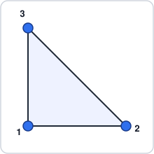
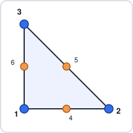
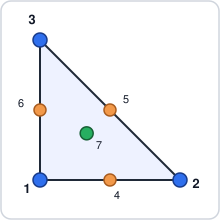
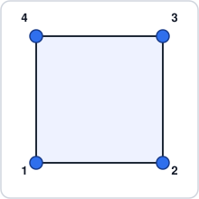
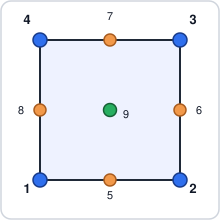
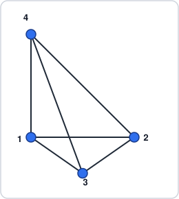
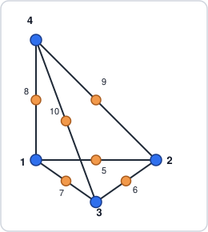
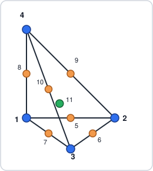
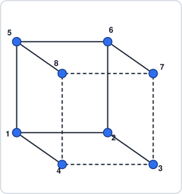
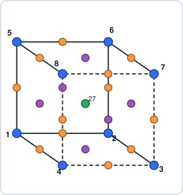

# Supported Elements

This page catalogs every reference element FEMTools.jl currently implements,
in 2-D and 3-D, with a sketch of its local node numbering. See
[Elements](@ref) for the corresponding API (element tags, shape functions,
and integration rules).

Each element is a [`LinearElement`](@ref) or [`QuadraticElement`](@ref) tag
parameterized by reference dimension and node count, e.g.
`LinearElement{2, 3}` for the linear triangle below. Node colors mark each
node's role:

- 🔵 corner (vertex) node
- 🟠 edge-midpoint node
- 🟣 face-center node (Hex27 only)
- 🟢 interior node — a bubble, centroid, or body-center enrichment

## 2-D Elements

### T3 — `LinearElement{2, 3}`

Linear triangle, order 1, 3 nodes (corners only). Reference domain
`ξ ≥ 0`, `η ≥ 0`, `ξ + η ≤ 1`.

### T6 — `QuadraticElement{2, 6}`

Quadratic triangle, order 2, 6 nodes: 3 corners plus the 3 edge midpoints
(4 = mid 1–2, 5 = mid 2–3, 6 = mid 3–1).

### T7 — `QuadraticElement{2, 7}`

T6 enriched with a cubic bubble at the centroid (node 7), used as the
velocity element of a MINI-type 2-D mixed mesh.

### Q4 — `LinearElement{2, 4}`

Bilinear quadrilateral, order 1, 4 corner nodes. Reference domain
`-1 ≤ ξ, η ≤ 1`.

### Q9 — `QuadraticElement{2, 9}`

Biquadratic quadrilateral, order 2, 9 nodes: 4 corners, 4 edge midpoints,
and 1 center node.

## 3-D Elements

### Tet4 — `LinearElement{3, 4}`

Linear tetrahedron, order 1, 4 corner nodes. Reference domain
`ξ, η, ζ ≥ 0`, `ξ + η + ζ ≤ 1`.

### Tet10 — `QuadraticElement{3, 10}`

Quadratic tetrahedron, order 2, 10 nodes: 4 corners plus the 6 edge
midpoints, ordered (12, 23, 13, 14, 24, 34).

### Tet10+bubble (T11) — `QuadraticElement{3, 11}`

Tet10 enriched with a bubble at the tetrahedron centroid (node 11), the
3-D counterpart of T7 — the velocity element of a MINI-type 3-D mixed mesh.

### Hex8 — `LinearElement{3, 8}`

Trilinear hexahedron, order 1, 8 corner nodes. Reference domain
`-1 ≤ ξ, η, ζ ≤ 1`. Dashed edges are the hidden back face, drawn only to
help read the sketch in 3-D.

### Hex27 — `QuadraticElement{3, 27}`

Triquadratic hexahedron, order 2, 27 nodes: 8 corners, 12 edge midpoints,
6 face centers, and 1 body-center node (27). Only the corners and the
body-center node are numbered above — see [`QuadraticElement`](@ref) for
the full ordering of nodes 9–26.

## Summary

| Element      | Tag                          | Dim | Nodes | Order |
|:------------ |:----------------------------- |:---:|:-----:|:-----:|
| T3           | `LinearElement{2, 3}`         | 2-D |   3   |   1   |
| T6           | `QuadraticElement{2, 6}`      | 2-D |   6   |   2   |
| T7           | `QuadraticElement{2, 7}`      | 2-D |   7   |   2   |
| Q4           | `LinearElement{2, 4}`         | 2-D |   4   |   1   |
| Q9           | `QuadraticElement{2, 9}`      | 2-D |   9   |   2   |
| Tet4         | `LinearElement{3, 4}`         | 3-D |   4   |   1   |
| Tet10        | `QuadraticElement{3, 10}`     | 3-D |  10   |   2   |
| Tet10+bubble | `QuadraticElement{3, 11}`     | 3-D |  11   |   2   |
| Hex8         | `LinearElement{3, 8}`         | 3-D |   8   |   1   |
| Hex27        | `QuadraticElement{3, 27}`     | 3-D |  27   |   2   |

`CubicElement` tags also exist but no cubic node ordering is implemented yet.
