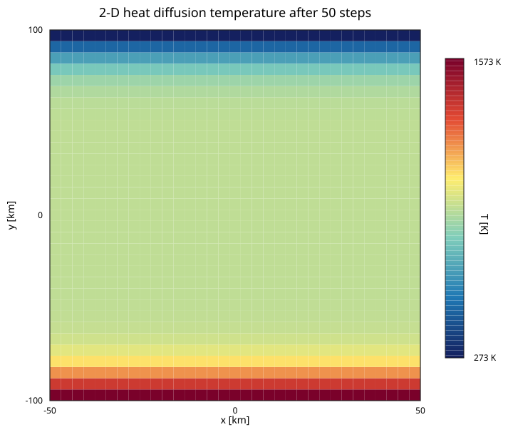

# Heat Diffusion

FEMTools.jl includes a transient multi-phase heat-diffusion solver based on a
pseudo-transient dynamic-relaxation (DR) scheme. The solver is backend-agnostic
and runs on both CPU and GPU via KernelAbstractions.jl.

## Physical model

The transient heat equation for a mixture of `nphases` phases is

```math
\sum_p \rho_p C_{p,p} \frac{\partial T}{\partial t} = \sum_p k_p \nabla^2 T + s
```

where the per-phase density follows a linearised equation of state

```math
\rho_p = \rho_{0,p} \bigl(1 - \alpha_p (T - T_\text{ref}) + P / K_p\bigr), \quad T_\text{ref} = 273\,\text{K}.
```

Material properties (`k`, `Cp`, `ρ0`, `α`, `K`) are grouped in a
`ThermalMaterial`. Each field is an `NTuple{nphases, FP}`, so phase count and
precision remain compile-time information. The reference temperature `Tref` is
passed to `solver!` when advancing the thermal field.

```@docs
ThermalMaterial
```

## Solver state

```@docs
ThermalDiffusionDR
```

### Constructor

```julia
material = ThermalMaterial(; k, Cp, ρ0, α, K)

# CPU (default)
dr = ThermalDiffusionDR(nnodes, material)

# Explicit backend (e.g. GPU)
using CUDA
dr = ThermalDiffusionDR(CUDABackend(), nnodes, material)
```

All keyword arguments (`CFL`, `c_fact`, `ϵ`) are converted to the float type
inferred from the phase-property tuples, so mixing `Float32` properties with
`Float64` literals in keyword arguments is safe.

### Example — two-phase problem

```julia
using FEMTools, DomainSets, KernelAbstractions

FP = Float64
nphases = 2

material = ThermalMaterial(;
    k  = (FP(3.0),    FP(5.0)),     # W m⁻¹ K⁻¹
    Cp = (FP(1000.0), FP(800.0)),   # J kg⁻¹ K⁻¹
    ρ0 = (FP(3000.0), FP(2700.0)),  # kg m⁻³
    α  = (FP(3e-5),   FP(2e-5)),    # K⁻¹
    K  = (FP(1e11),   FP(8e10)),    # Pa
)
Tref = FP(273.0)               # K

element = ReferenceElement(LinearElement{1, 2})
mesh = Mesh(0.0..1.0, element, 100)
dr   = ThermalDiffusionDR(CPU(), mesh.nnodes, material; CFL=0.9)
```

## Structured 2-D Example

The script `examples/heat_diffusion/2D_heat_diffusion.jl` solves transient heat
diffusion on a structured 2-D quadratic mesh. It uses a hot lower boundary
(`1573 K`), a cold upper boundary (`273 K`), and insulated side boundaries:

```julia
using FEMTools, DomainSets, KernelAbstractions, StaticArrays
using DomainSets: ×

backend   = CPU()
workgroup = 64

FP      = Float64
Lx, Ly  = 50e3, 100e3
Ω       = (-Lx..Lx) × (-Ly..Ly)
element = ReferenceElement(QuadraticElement{2, 9, FP})
mesh    = Mesh(backend, Ω, element, (30, 30))

material = ThermalMaterial(;
    k = (FP(3.0), FP(2.5)), Cp = (FP(1200.0), FP(1100.0)),
    ρ0 = (FP(3300.0), FP(2700.0)), α = (FP(3e-5), FP(2e-5)),
    K = (FP(1e11), FP(8e10)),
)
Tref = FP(273.0)

dr = ThermalDiffusionDR(backend, mesh.nnodes, material; CFL=FP(0.9))
```

The full example applies Dirichlet boundary conditions at the top and bottom,
then advances the field with `solver!` for 50 time steps. Run it from the
examples environment:

```sh
julia --project=examples examples/heat_diffusion/2D_heat_diffusion.jl
```

The resulting temperature field is:



## Assembly

Shared element integration lives in `assembly/residual.jl`; atomic and colored
routing live in `residual_atomics.jl` and `residual_colored.jl`. All paths
operate on element-local `SVector`s inside KernelAbstractions kernels:

| Function | Role |
|:-------- |:---- |
| `assemble_diffusion_matrices_atomix!` | Top-level assembler; fills `R`, `∂R∂T`, `PC` using atomic scatter |
| `assemble_diffusion_matrices_colored!` | Top-level assembler; uses conflict-free element color groups instead of atomics |
| `integrate_residual` | Quadrature-point loop; returns the element residual `SVector` |
| `element_residual` | Gathers element-local fields and calls `integrate_residual` |
| `element_jacobian` | ForwardDiff Jacobian of `integrate_residual`; returns row sums and diagonal |

## Reference

`solver!` advances the field for one time step; the pseudo-transient update
kernels and Dirichlet enforcement are shared by all dynamic-relaxation solvers.

```@docs
solver!
FEMTools.apply_dirichlet!
FEMTools.update_rate_kernel!
FEMTools.update_variable_kernel!
FEMTools.assemble_diffusion_matrices_atomix!
FEMTools.assemble_diffusion_matrices_colored!
FEMTools.element_residual
FEMTools.element_jacobian
FEMTools.integrate_residual
```
