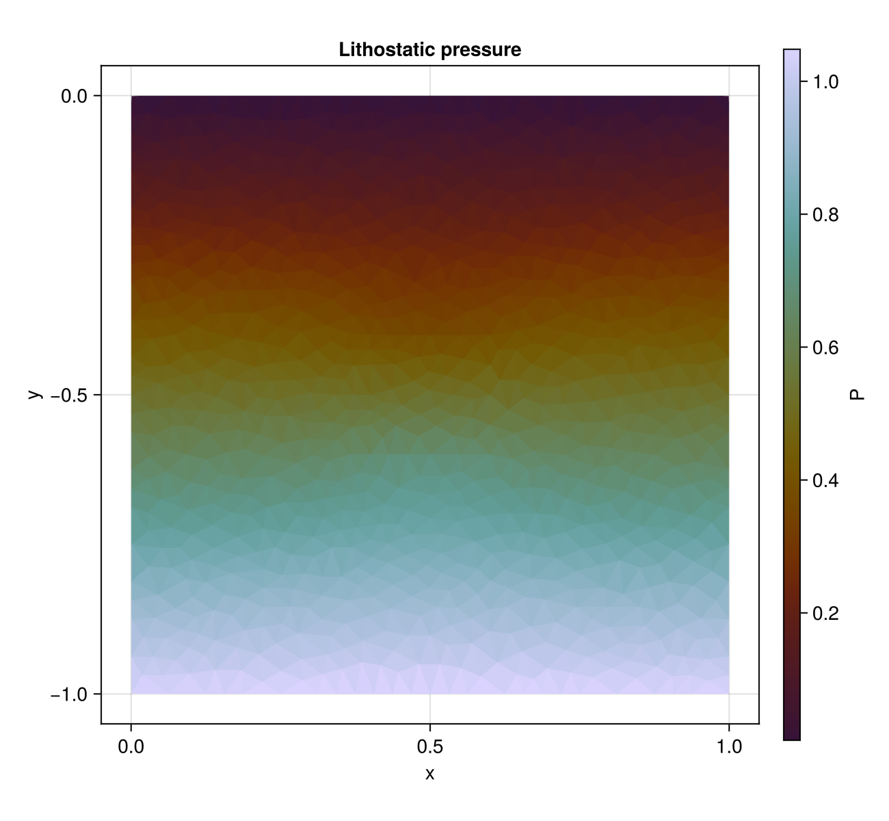
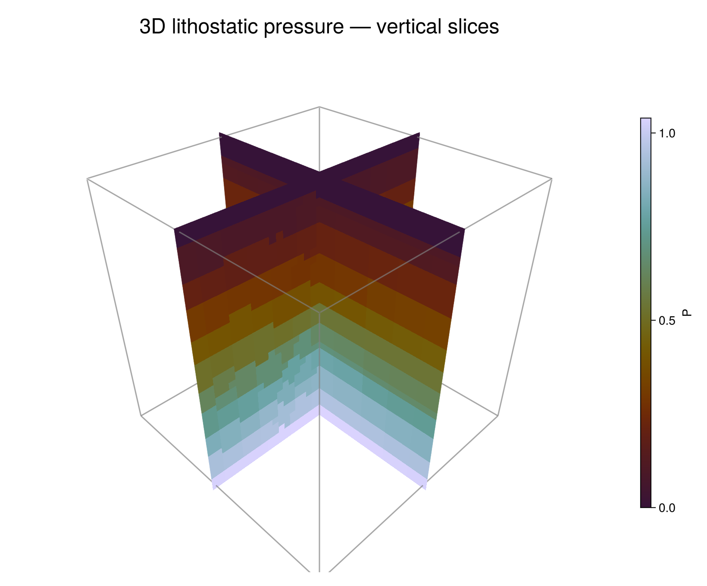

# Lithostatic Pressure

FEMTools.jl computes the pressure required to balance gravity in a stationary
material. The solver supports multiple compressible or incompressible phases,
temperature-dependent density, unstructured finite-element meshes, and CPU or
GPU execution through KernelAbstractions.jl.

Two complete examples accompany this page:

- `examples/miniapps/stokes/lithostatic_pressure2D/lithostatic_pressure2D.jl` uses an unstructured
  triangular mesh derived from the sinking-block example.
- `examples/miniapps/stokes/lithostatic_pressure3D/lithostatic_pressure3D.jl` uses Gmsh.jl to
  create an unstructured quadrilateral base and extrudes it into linear Hex8
  elements.

## Governing equations

Static force balance without deviatoric stress is

```math
-\nabla P + \rho\mathbf{g} = \mathbf{0},
```

where ``P`` is pressure, ``\rho`` is density, and ``\mathbf{g}`` is the
gravitational-acceleration vector. FEMTools solves its weak form

```math
\int_\Omega \nabla P\cdot\nabla v\,\mathrm{d}\Omega
=
\int_\Omega \rho(P,T)\,\mathbf{g}\cdot\nabla v\,\mathrm{d}\Omega
\qquad \forall v,
```

or, equivalently,

```math
\int_\Omega \nabla v\cdot
\left(\rho\mathbf{g}-\nabla P\right)\,\mathrm{d}\Omega=0.
```

For phase ``p``, density follows the linearised equation of state

```math
\rho_p(P,T)=\rho_{0,p}
\left[1-\alpha_p(T-T_\mathrm{ref})+\frac{P}{K_p}\right],
```

with reference density ``\rho_{0,p}``, thermal expansivity ``\alpha_p``, bulk
modulus ``K_p``, and reference temperature ``T_\mathrm{ref}``. Setting
``K_p=\infty`` removes pressure-dependent compressibility. Both examples are
isothermal and incompressible, so ``\rho_p=\rho_{0,p}``.

At an integration point ``q``, the discrete element residual is

```math
\mathbf{R}_e = \sum_q w_q |J_q|\,
\mathbf{B}_q^\mathsf{T}
\left(\rho_q\mathbf{g}-\mathbf{B}_q\mathbf{P}_e\right),
```

where ``\mathbf{B}_q`` contains physical shape-function gradients and
``\mathbf{P}_e`` contains the element nodal pressures.

## Boundary conditions

The examples use a traction-free surface at ``y=0``:

```math
P=0 \qquad \text{on } \Gamma_\mathrm{top}.
```

All other boundaries receive the natural zero-flux condition implied by the
weak form,

```math
\left(\nabla P-\rho\mathbf{g}\right)\cdot\mathbf{n}=0
\qquad \text{on } \partial\Omega\setminus\Gamma_\mathrm{top}.
```

With ``\mathbf{g}=(0,-g,0)`` and constant density, the one-dimensional
reference solution is therefore

```math
P(y)=\rho g(-y), \qquad -L_y\le y\le0.
```

The examples use this profile as the initial guess. A denser block with
``\rho_2=2\rho_1`` perturbs the pressure locally.

## Dynamic-relaxation solver

`LithostaticPressureDR` converges the steady equation through pseudo-time. For
iteration ``k``, the preconditioned rate and pressure updates are

```math
\dot{\mathbf{P}}^{k+1}
=\mathbf{M}^{-1}\mathbf{R}^k+\beta\dot{\mathbf{P}}^k,
\qquad
\mathbf{P}^{k+1}=\mathbf{P}^k+\alpha_\mathrm{DR}\dot{\mathbf{P}}^{k+1},
```

where ``\mathbf{M}`` is a diagonal preconditioner assembled from the element
Jacobian. Spectral estimates ``\lambda_\min`` and ``\lambda_\max`` determine
the Chebyshev parameters

```math
\Delta\tau=\frac{2\,\mathrm{CFL}}{\sqrt{\lambda_\max}},
\quad c=2c_\mathrm{fact}\sqrt{\lambda_\min},
\quad
\alpha_\mathrm{DR}=\frac{2\Delta\tau^2}{2+c\Delta\tau},
\quad
\beta=\frac{2-c\Delta\tau}{2+c\Delta\tau}.
```

Iteration stops when

```math
\frac{\lVert\mathbf{R}^k\rVert_2}
{\max(\lVert\mathbf{R}^0\rVert_2,\epsilon_\mathrm{mach})}<\epsilon.
```

## Two-dimensional example

The 2-D domain is ``[0,1]\times[-1,0]``. It contains a square dense block
centred at ``(0.5,-0.5)`` with half-width `0.1`. Triangulate.jl first creates
the constrained sinking-block mesh; the example then extracts its three-node
corner connectivity and solves on linear T3 pressure elements. The material
parameters are

```math
\rho_1=1,\qquad \rho_2=2,\qquad
\mathbf{g}=(0,-1),\qquad \alpha_1=\alpha_2=0,
\qquad K_1=K_2=\infty.
```

```julia
element = ReferenceElement(LinearElement{2, 3, Float64})
mesh = Mesh(backend, coords, el2n, element; workgroup)

dr = LithostaticPressureDR(backend, mesh.nnodes, material;
                           CFL=0.9, c_fact=0.9, ϵ=1e-6)
bc = DirichletBoundaryCondition(nothing, top_nodes, zeros(length(top_nodes)))
solver!(dr, mesh, bc; workgroup, ncheck=25, Tref=0.0, g=(0.0, -1.0))
```



Pressure is zero at the upper surface and increases with depth. The denser
inclusion produces the small lateral departure from the homogeneous linear
profile around the centre of the domain.

Run the example from the repository root with

```sh
julia --project=examples examples/miniapps/stokes/lithostatic_pressure2D/lithostatic_pressure2D.jl
```

## Three-dimensional example

The 3-D domain is the unit cube ``[0,1]^3``, with ``z`` vertical and gravity
along ``-z``. Gmsh creates an unstructured recombined quadrilateral mesh in the
horizontal ``x``-``y`` plane, then extrudes it upward through eight layers. The
resulting mesh contains only Gmsh type-5 linear hexahedra; the example rejects
mixed volume-element output. The dense block is centred at ``(0.5,0.5,0.5)``
with half-width `0.15`, and the pressure is pinned on the top face ``z=1``.

```julia
element = ReferenceElement(LinearElement{3, 8, Float64})
mesh = Mesh(backend, coords, el2n, element; workgroup)

g = SA[0.0, 0.0, -1.0]
dr = LithostaticPressureDR(backend, mesh.nnodes, material;
                           CFL=0.9, c_fact=0.9, ϵ=1e-6)
solver!(dr, mesh, bc; workgroup, ncheck=25, Tref=0.0, g=g)
```



The two vertical slices intersect at the centre of the dense block. For
visualisation, the unstructured Hex8 nodal solution is resampled onto a regular
grid; the pressure solve itself remains on the original Gmsh mesh.

The default mesh has 1,260 nodes and 952 Hex8 elements. The script writes
`lithostatic_pressure3D.vtk`, containing nodal `pressure` and `phase` fields,
for inspection in ParaView:

```sh
julia --project=examples examples/miniapps/stokes/lithostatic_pressure3D/lithostatic_pressure3D.jl
```

## Solver API

An element-aware `Mesh` stores the reference element and precomputed geometry.
Set `dr.T` before solving when thermal density variations are active.

```julia
material = ThermalMaterial(; k, Cp, ρ0, α, K)
dr = LithostaticPressureDR(backend, mesh.nnodes, material)
copyto!(dr.T, temperature)
solver!(dr, mesh, bc; Tref=273.0, g=(0.0, -9.81))
P = Array(pressure(dr))
```

```@docs
LithostaticPressureDR
solver!(::LithostaticPressureDR, ::Mesh, ::DirichletBoundaryCondition)
FEMTools.assemble_lithostatic_pressure_matrices_atomix!
FEMTools.assemble_lithostatic_pressure_matrices_colored!
FEMTools.lp_element_residual
FEMTools.lp_element_jacobian
FEMTools.lp_integrate_residual
```
