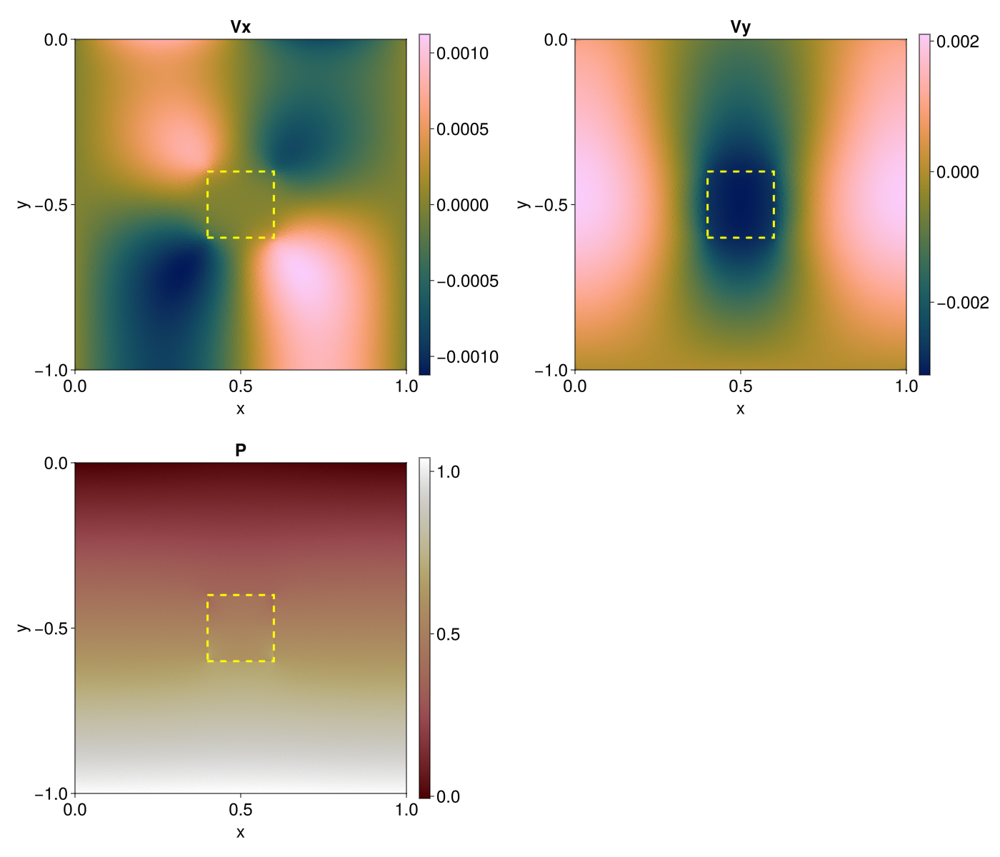

# Two-dimensional sinking block

A denser, more viscous rectangular block sinks through a lighter matrix under
gravity. The example is the compact end-to-end exercise of the package's 2-D
Stokes path: an interface-conforming Gmsh mesh, the T7 (quadratic-plus-bubble)
/ P1-disc element pair, the Powell–Hestenes/DYREL saddle-point solver, and a
discrete adjoint that differentiates an observation-window velocity objective
with respect to density and viscosity using Enzyme.

```sh
julia --project=examples examples/miniapps/stokes/sinking_block/sinking_block.jl
julia --project=examples examples/miniapps/stokes/sinking_block_adj/sinking_block_adj.jl
```

## Geometry and mesh

Both scripts build the same square, `Lx = Ly = 1`, but place it differently.
`sinking_block.jl` meshes `x ∈ [0,Lx]`, `y ∈ [-Ly,0]`, so gravity `g = (0,-1)`
pulls straight down toward the bottom of the domain and the inclusion sits at
`(Lx/2, -Ly/2)`. `sinking_block_adj.jl` builds the identical mesh and then
shifts every coordinate by `(-Lx/2, Ly/2)`, re-centring the domain — and the
inclusion — on the origin; this only changes where boundaries and the
inclusion are found in the script, not the discretisation itself.

`build_gmsh_t7_rectangle_inclusion_mesh` (in `examples/gmsh_meshing.jl`)
fragments the domain rectangle and the inclusion rectangle with
`gmsh.model.occ.fragment` before meshing, so the material interface lies
exactly on triangle edges — a conforming mesh, unlike the 3-D example's
staircase approximation of the block. Gmsh returns 6-node P2 triangles;
`add_t7_bubbles!` appends the seventh, interior bubble node that turns them
into T7 elements. `half_width` sets the inclusion half-width in both
directions and `max_area` the target triangle area.

Every pressure triangle takes a phase from its centroid: phase 1 outside the
inclusion, phase 2 inside. `η`, `ρ0`, `G`, `α`, and `K` are two-entry tuples
indexed by that phase.

| Quantity | Value | Meaning |
|---|---|---|
| `half_width` | `0.1` | inclusion half-width in both directions |
| `η` | `(1.0, 100.0)` | matrix and inclusion shear viscosity |
| `ρ0` | `(1.0, 2.0)` | matrix and inclusion reference density |
| `K`, `G` | `(Inf, Inf)` | bulk/shear modulus — `Inf` gives a purely viscous, incompressible response |
| `g` | `(0.0, -1.0)` | gravity vector |
| `ϵ_tol` | `1e-6` | relative combined residual tolerance |
| `γfact` | `20.0` | Powell–Hestenes augmentation strength |

`max_area` (default `1/64²`) and `show_plot` are the forward script's only
keyword arguments; every other row above is a constant inside the script body.
The adjoint script's `main` exposes far more of these as keywords instead —
`η_incl` (the inclusion viscosity, default `1.0`), `Δt`, `ncheck`, `ϵ_tol`,
`iterMax`, `total_iterMax`, their `adjoint_*` counterparts, `γfact` (default
`40.0`), `CFL_v`, `c_fact`, and the power-iteration controls for `λmax` — see
its docstring for the complete list. `half_width`, `ρ0`, `K`, `G`, and the
adjoint's observation window (below) remain fixed inside its body.

## Discretization

Velocity uses the T7 element: a standard 6-node quadratic (P2) triangle plus
one interior bubble function,
`ReferenceElement(QuadraticElement{2,7,Float64})`. Pressure uses three
discontinuous, cell-local linear modes `(1,ξ,η)`,
`ReferenceElement(LinearElement{2,3,Float64})`. The bubble is what makes the
pair inf-sup stable; a plain P2/P1-disc pair would reintroduce pressure
checkerboard modes.

Both fields are combined into one `MixedMesh(mesh_v, element_P)`
([Mesh](mesh.md)), which precomputes both fields' geometry at the velocity
quadrature points once and stores it as `mesh_stokes.geometry`. Unlike the 3-D example, the 2-D example
does build a [`StokesDR`](stokes.md): the mixed-mesh Arrow–Hurwicz/DYREL
solver needs its lumped pressure mass, viscosity-weighted pressure-step array
`γP` (from
[`FEMTools.assemble_viscosity_weighted_pressure_scaling!`](@ref)), stress
history, and diagonal preconditioner, all of which live there.

## Boundary conditions

Free slip on all four walls: `vx_nodes` and `vy_nodes` are the boundary nodes
(`mesh_v.Γnodes`) lying on a wall normal to `x` or `y` respectively, found with
a coordinate tolerance rather than exact equality. Two
`DirichletBoundaryCondition`s pin the wall-normal component to zero and are
applied once with `apply_bc!` before the first residual assembly; unlike the
3-D solver's `fixed_nodes`/`bc_values` tuple pair, the mixed-mesh solver takes
`bc_vx` and `bc_vy` positionally and re-applies them internally after every
update. Pressure carries no Dirichlet constraint; it floats relative to the
initial guess described next.

## Forward solve

Before the Powell–Hestenes/DYREL solve, both scripts warm-start the pressure
field: they collect the mesh's unique P1 corner nodes into a small scalar
mesh, solve a hydrostatic pressure profile on it with
[`LithostaticPressureDR`](lithostatic_pressure.md), and copy the result into
both `dr.P` and `dr.P0`. This gives the outer pressure iteration a
physically-scaled starting point instead of zero, rather than acting as a hard
constraint on the converged answer.

The forward call is `solve_stokes_dyrel!(dr, mesh_stokes, bc_vx, bc_vy,
Δt, γP; phases_v, phases_P, τ_old, plastic, ncheck, ϵ_tol, iterMax,
total_iterMax, rel_drop0, ...)`, the same mixed-mesh entry point described in
[Stokes](stokes.md#Compact-setup): an outer Arrow–Hurwicz pressure update
wrapping an inner Chebyshev-accelerated DYREL sweep on the momentum residual.
`iterMax` bounds one inner sweep, `total_iterMax` the whole solve, and
`rel_drop0` how far the inner velocity residual must drop before the outer
pressure update fires.

After convergence, `update_stokes_current_stress!` refreshes `dr.τ` and
`compute_strain_rate_stress_postprocess` derives nodal strain-rate and stress
diagnostics (including the second invariant `tauII`) from the converged
velocity. `write_stokes_vtk` writes `stokes_2D_sinking_block.vtk` under
`output_stokes/`, holding velocity, pressure, phase, and those postprocessed
fields. With `show_plot = true` (the default), the script also displays a
three-panel GLMakie figure of `Vx`, `Vy`, and `P` with the inclusion outlined.



`Vy` is negative in a vertical band above and below the inclusion — where the
sinking block drags the surrounding matrix down with it — and positive near
the side walls, where the flow returns upward. `Vx` shows the four-lobed
circulation typical of a localized sinking load in a bounded box. `P` is
dominated by the depth-dependent lithostatic gradient, with a small local
perturbation at the inclusion.

## Discrete adjoint

For the linear system and scalar objective

```math
A(m)u=b(m), \qquad J=c^T u,
```

the sensitivity to a material parameter ``m`` follows from one transpose solve

```math
A^T\lambda=c, \qquad
\frac{\mathrm dJ}{\mathrm dm}
=\lambda^T\left(\frac{\partial b}{\partial m}
-\frac{\partial A}{\partial m}u\right),
```

exactly as in the [3-D adjoint](sinking_block_3d.md#Discrete-adjoint). The
objective itself differs: rather than a plain nodal average, it is the
consistently assembled finite-element integral

```math
J(v_y) = -\int_{\Omega_{\mathrm{obs}}} v_y \, \mathrm d\Omega,
```

over the observation box `objective_bounds = (-0.2, 0.2, 0.2, 0.3)`,
positioned just above the inclusion. `assemble_objective_vy!` builds the load
`c = ∂J/∂v` element by element, subtracting `Nᵢ dΩ` at every quadrature point
that falls inside the box — so a cut element contributes only the
shape-function-weighted fraction of itself that lies in the window, rather
than an all-or-nothing indicator.

The viscous operator is symmetric, so `Aᵀ = A` and
[`solve_stokes_adjoint_dyrel!`](@ref) reuses the forward's frozen transpose
Jacobian, preconditioner, and boundary nodes with `c` as its momentum load —
see [Stokes](stokes.md#Two-dimensional-frozen-operator-and-solver-controls)
for the dense-block caching this relies on.

Material sensitivities are obtained differently than in 3-D, where
`stokes_material_gradient_3d` contracts the forward and adjoint velocities
analytically. Here, `launch_material_contraction!` assembles the per-element
contraction `λᵉᵀ Rᵉ(m)` from the true element residual, and Enzyme reverse
mode (`Enzyme.autodiff_deferred`) differentiates that assembly with respect to
per-element density and viscosity fields in one pass, giving both
`density_sensitivity` and `viscosity_sensitivity` at once. Summing the
entries belonging to one phase gives that phase's scalar gradient; dividing by
element area turns the raw integrals into a mesh-independent sensitivity
density, used only for the summary plot.

## Verification

`test/test_stokes_adjoint_api.jl` builds a small T7/P1-disc buoyancy case —
the same element pair, free-slip walls, and observation-window objective as
this example — and checks that `solve_stokes_adjoint_dyrel!` reproduces the
density gradient obtained from centred finite differences on the same
discrete objective, directly validating the transpose-consistency argument
above without a separate sparse reference assembly.

## Three-dimensional counterpart

The block-in-matrix problem has an independent three-dimensional version with
its own mesh, element pair, and matrix-free solver: [Three-dimensional
sinking block](sinking_block_3d.md). Use the 2-D pair to experiment with
rheology — it carries the full stress-history / Powell–Hestenes machinery,
including elasticity and plasticity; the 3-D pair is linear viscous only, but
its matrix-free forward and adjoint solvers scale to much larger meshes.
