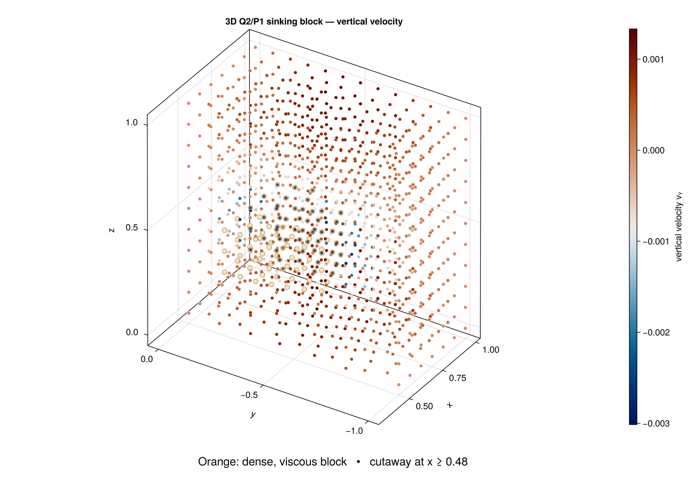

# Three-dimensional sinking block

A dense, stiff cube embedded in a lighter, weaker matrix descends under gravity.
The example is the compact end-to-end exercise of the package's 3-D Stokes path:
Gmsh mesh generation, the Hex27 Q2/P1-disc element pair, the matrix-free DYREL
solver, and the discrete adjoint that differentiates the result with respect to
material properties.

```sh
julia --project=examples examples/miniapps/stokes/sinking_block_3D/sinking_block_3D.jl
julia --project=examples examples/miniapps/stokes/sinking_block_3D_adj/sinking_block_3D_adj.jl
```

## Geometry and mesh

The domain is the unit cube ``[0,1]^3``, with ``z`` the vertical axis and
gravity acting along ``-z``. Gmsh meshes the horizontal ``x``-``y`` plane with
recombined quadrilaterals, extrudes that surface upward through `nz` layers, and
raises the resulting hexahedra to second order. A fixed permutation converts
Gmsh's type-12 node ordering to the [`QuadraticElement{3,27}`](@ref) ordering
used by FEMTools; the example rejects mixed volume-element output rather than
silently meshing something else.

The block is the set of cells whose centroid lies within `half_width` of
``(0.5,0.5,0.5)`` in every coordinate direction. Cells take a phase whole, so
the block is a staircase approximation of the cube whose fidelity depends on
`mesh_size` and `nz`. Phase 1 is the matrix and phase 2 the block; both index
into the `η` and `ρ` tuples. The example errors out if no cell resolves the
block at all.

| Parameter | Default | Meaning |
|---|---|---|
| `mesh_size` | `0.2` | horizontal target edge length |
| `nz` | `5` | number of extrusion layers |
| `half_width` | `0.15` | block half-width in every direction |
| `η` | `(1.0, 100.0)` | matrix and block viscosity |
| `ρ` | `(1.0, 2.0)` | matrix and block density |
| `g` | `(0.0, 0.0, -1.0)` | gravity vector |
| `solver_tol` | `1e-6` | absolute combined residual tolerance |

The default problem contains 225 Hex27 cells and 2,255 velocity nodes.

## Discretization

Velocity uses continuous Q2 functions with 27 nodes per cell. Pressure is *not*
carried by the element: it lives in a separate ``4 \times n_{els}`` array holding
the four discontinuous P1 modes

```math
(1,\xi,\eta,\zeta),
```

so every cell owns four pressure unknowns and the discrete problem has
``3 n_{nodes}`` velocity and ``4 n_{els}`` pressure degrees of freedom. Only the
first, cell-constant mode has a single cell-centre value, which is what the VTK
output records.

## Boundary conditions

Free slip on all six walls: each wall pins only the velocity component *normal*
to it, leaving tangential flow along the wall unconstrained. The constraint is
passed as a 3-tuple `fixed_nodes`, where entry `c` lists the nodes whose
component `c` is held at zero, so a node on an edge or corner appears once per
wall it touches. Wall membership is tested against a tolerance rather than exact
equality, because extruded coordinates land on a wall only to rounding.

## Forward solve

The forward problem calls `solve_stokes_dyrel!`, the same public entry point the
2-D example uses; multiple dispatch selects the 3-D layout of three velocity
components plus cell-local pressure modes. Velocity and pressure are
caller-owned and updated in place from the supplied initial guess.

The example holds velocity in a
[`VectorField3D`](field_containers.md) and passes `Tuple(velocity)` to the
solver, which takes the three component arrays positionally. The tuple shares
those arrays, so the in-place updates land back in the container.

It deliberately does not build a [`StokesDR`](stokes.md). That state is
dimension-generic and a three-dimensional one is constructible, but it also
carries a stress history, temperature, and the pseudo-transient and
preconditioner work arrays that this matrix-free method never touches. The bare
velocity container is the whole of the state the 3-D solver needs.

`ncheck` sets how often the residual norms are recomputed and reported, `ϵ_tol`
the absolute combined tolerance, and `total_iterMax` the iteration budget the
3-D method enforces. `velocity_step` and `γP` scale the velocity and pressure
updates. The returned statistics carry `iter`, `err`, `err_v`, `err_P`,
`converged`, and `reached_total_iter`; the example raises an error rather than
returning a silently unconverged field. [`solve_stokes_3d!`](@ref) remains as a
compatibility wrapper mapping `maxiter`, `tolerance`, and `pressure_step` onto
those keywords.

`run_sinking_block_3d` returns the mesh, velocity and pressure, cell phases,
constrained nodes, solver statistics, and the material inputs. The returned
`velocity` is the `VectorField3D`, so components are reached as `velocity.x`,
`velocity.y`, `velocity.z`. With
`write_output=true` it also writes `stokes_3D_sinking_block.vtk` holding the
three velocity components, cell-centre pressure, and material phase.



The blue region around the block has negative vertical velocity, while the
wall-normal velocity is exactly zero on every boundary face. For this figure,
the unstructured nodal field is sampled to a regular ``51^3`` visualization grid
and sliced through the block centre.

## Discrete adjoint

For the linear system and scalar objective

```math
A(m)u=b(m), \qquad J=c^T u,
```

the sensitivity to a material parameter ``m`` follows from one transpose solve

```math
A^T\lambda=c, \qquad
\frac{\mathrm dJ}{\mathrm dm}
=\lambda^T\left(\frac{\partial b}{\partial m}
-\frac{\partial A}{\partial m}u\right),
```

which delivers the gradient with respect to every parameter at once, instead of
one forward solve per parameter as finite differences require.

The objective here is ``J=\mathrm{mean}(v_z)`` over the velocity nodes belonging
to the dense block — its sinking rate. The load ``c=\partial J/\partial v``
therefore carries ``1/N`` on the vertical component at those nodes and zero
everywhere else.

The linear viscous operator is symmetric, so ``A^T=A`` and
[`solve_stokes_adjoint_dyrel!`](@ref) reuses the forward residual and
preconditioner with ``c`` as its momentum load. The constrained nodes carry over
unchanged for the same reason. [`solve_stokes_adjoint_3d!`](@ref) is the
matching compatibility wrapper.

[`stokes_material_gradient_3d`](@ref) then contracts ``\lambda`` against
``\partial b/\partial\rho`` and ``(\partial A/\partial\eta)u`` for one phase,
phase 2 by default. Density changes the gravity load; viscosity changes that
phase's viscous matrix contribution. Both derivatives are applied as residual
evaluations with unit material properties, so neither derivative matrix is ever
assembled — the adjoint example builds no system matrix at any point.

## Verification

`test/test_stokes_3d_reference.jl` assembles the sparse Q2/P1-disc saddle-point
system independently, as an exact oracle for the matrix-free path. It checks
that the matrix-free residual reproduces ``Au-b``, that the iterative adjoint
matches ``A^{-T}c`` computed by a direct solve, and that both material gradients
agree with centred finite differences taken on the sparse system.
